# W5 Evidence Pack - 5XRestaurant / EatEase

> File nộp tuần 5 theo yêu cầu trong `W5_learner_guide_vi.md` và `W5_project_announcement_vi.md`.  
> Mục tiêu: chứng minh dự án đã bổ sung lớp hardening tuần 5 bằng cấu hình AWS thật, ảnh chụp màn hình và ghi chú ngắn.

## 1. Cover

| Mục | Nội dung |
|---|---|
| Nhóm | VIBE_TEAM |
| Thành viên | TODO: điền danh sách thành viên |
| Dự án | 5XRestaurant / EatEase |
| Lĩnh vực | Restaurant Management System |
| AWS Account | `288674664863` |
| Region | `us-east-1` - N. Virginia |
| Repo | TODO: điền link GitHub repo |
| Evidence Pack | `docs/W5_evidence.md` |
| CloudFront URL | `https://d3jb1nthonaw9b.cloudfront.net` |
| ALB DNS | `dh-app-alb-617638449.us-east-1.elb.amazonaws.com` |
| API Gateway URL | `https://qcrj9djdh4.execute-api.us-east-1.amazonaws.com/prod` |
| Evidence Pack tuần trước | TODO: điền link nếu có |

### Tóm tắt dự án

EatEase là ứng dụng quản lý nhà hàng gồm frontend React/Vite và 3 backend microservices chạy trên ECS Fargate:

- `user-service`: xác thực, user, customer, voucher, booking.
- `menu-service`: category, product, file, chat/AI.
- `order-service`: order, kitchen, payment, support, socket.

Tuần 5 bổ sung các lớp hardening:

- MH1: Single VPC multi-AZ + VPC Flow Logs.
- MH2: AWS Network Firewall cho outbound path trước NAT Gateway.
- MH3: EFS mount vào app tier + AWS Backup + restore test.
- MH4: API Gateway + API key + throttling trước Lambda.
- MH5: Lambda scaling pattern bằng async processing + DLQ.

### Ảnh cần chụp

**[CHỤP MÀN HÌNH - Cover 01] Evidence Pack trong GitHub**


---

## 2. MH1 - Multi-VPC Connectivity / Observable Network

### Yêu cầu đề bài

Chọn một trong ba hướng:

- VPC Peering.
- Transit Gateway.
- Justified Single-VPC.

Bắt buộc:

- Có lý do chọn topology.
- Có VPC Flow Logs bật trên VPC.
- Có sample log entry trong Evidence Pack.

### Lựa chọn của dự án

Team chọn **Justified Single-VPC**.

### Lý do chọn Single-VPC

EatEase hiện là một hệ thống cùng business domain nhà hàng. `user-service`, `menu-service`, `order-service` dùng chung database `eatease` và cùng nằm trong một deployment boundary. Hiện chưa có yêu cầu tách compliance, partner network, on-prem connectivity hoặc domain độc lập. Vì vậy single VPC multi-AZ, chia subnet theo public/app/db/firewall là hợp lý và đơn giản hơn VPC Peering hoặc Transit Gateway.

Nếu sau này có payment/PCI workload riêng, partner integration hoặc analytics platform độc lập, team sẽ cân nhắc tách VPC và dùng Transit Gateway.

### Cấu hình AWS

| Mục | Giá trị |
|---|---|
| VPC | `dh-main-vpc` |
| VPC ID | `vpc-01759ee401648ec3a` |
| CIDR | `10.0.0.0/16` |
| Region | `us-east-1` |

| Subnet | Subnet ID | CIDR | AZ | Vai trò |
|---|---|---|---|---|
| `dh-public-az1` | `subnet-08d46c18e5ed4cdd6` | `10.0.1.0/24` | `us-east-1a` | ALB, NAT |
| `dh-public-az2` | `subnet-0721b1899607c0ef1` | `10.0.2.0/24` | `us-east-1b` | ALB |
| `dh-private-app-az1` | `subnet-010ae035f25b966c8` | `10.0.11.0/24` | `us-east-1a` | ECS |
| `dh-private-app-az2` | `subnet-094c282bf665c91ac` | `10.0.12.0/24` | `us-east-1b` | ECS |
| `dh-private-db-az1` | `subnet-0d64e4158a2ab636d` | `10.0.21.0/24` | `us-east-1a` | RDS/Redis |
| `dh-private-db-az2` | `subnet-0f51934c6f7520f67` | `10.0.22.0/24` | `us-east-1b` | RDS/Redis |
| `dh-firewall-az1` | `subnet-0fab038d203962cf0` | `10.0.101.0/24` | `us-east-1a` | Network Firewall |
| `dh-firewall-az2` | `subnet-02e2bd9ee1b3c3aa3` | `10.0.102.0/24` | `us-east-1b` | Network Firewall |

### VPC Flow Logs

| Mục | Giá trị |
|---|---|
| Flow log ID | `fl-0190a24405ae975ce` |
| Resource | `vpc-01759ee401648ec3a` |
| Traffic type | ALL |
| Destination | CloudWatch Logs |
| Log group | `/aws/vpc/dh-flowlogs` |
| Deliver status | SUCCESS |
| Flow log status | ACTIVE |

### Ảnh cần chụp

**[CHỤP MÀN HÌNH - MH1 01] VPC overview**

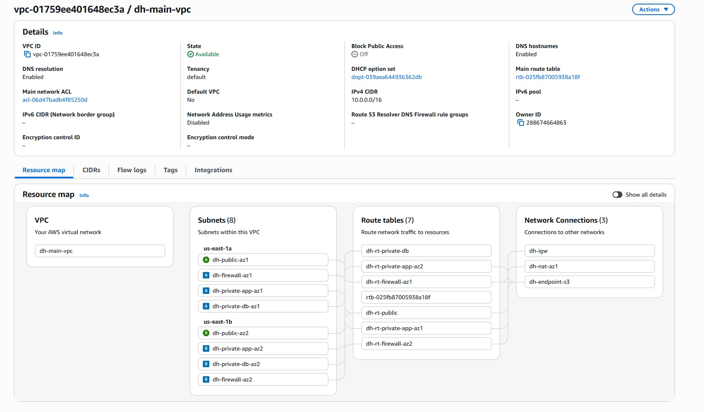

**[CHỤP MÀN HÌNH - MH1 02] 8 subnet multi-AZ**

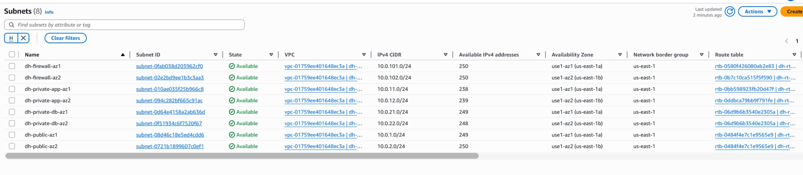

**[CHỤP MÀN HÌNH - MH1 03] Flow Logs enabled**

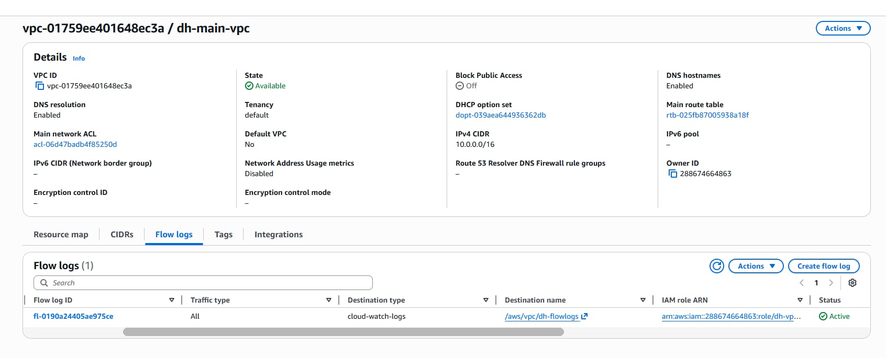

**[CHỤP MÀN HÌNH - MH1 04] Flow Logs ACCEPT sample**

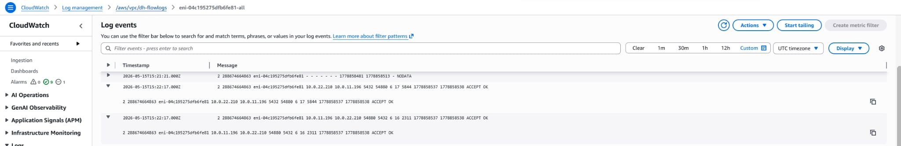

**[CHỤP MÀN HÌNH - MH1 05] Flow Logs REJECT sample**

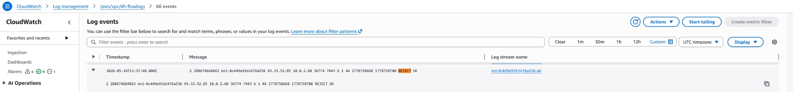

---

## 3. MH2 - Network Firewall Hardening

### Yêu cầu đề bài

Nếu workload trong VPC có đường ra internet qua NAT Gateway thì phải dùng AWS Network Firewall path.

Bắt buộc:

- Có firewall subnet riêng.
- Có stateful rule group.
- Có Alert Logs bật.
- Route table private subnet phải đi qua firewall endpoint trước NAT Gateway.
- Có bằng chứng một request bị chặn trong Alert Logs.

### Cấu hình AWS

| Mục | Giá trị |
|---|---|
| Firewall | `dh-app-firewall` |
| Status | READY |
| VPC | `vpc-01759ee401648ec3a` |
| Policy | `dh-app-firewall-policy` |
| Stateful rule group | `dh-allowed-domains` |
| AZ1 endpoint | `vpce-0b40061b5d91f4353` |
| AZ2 endpoint | `vpce-04fd5577e84f34f9b` |
| Alert log group | `/aws/network-firewall/dh-firewall` |

### Route path

```text
ECS task trong private app subnet
  -> Network Firewall endpoint cùng AZ
  -> NAT Gateway
  -> Internet
```

| Route table | Route quan trọng |
|---|---|
| `dh-rt-private-app-az1` | `0.0.0.0/0 -> vpce-0b40061b5d91f4353` |
| `dh-rt-private-app-az2` | `0.0.0.0/0 -> vpce-04fd5577e84f34f9b` |
| `dh-rt-firewall-az1` | `0.0.0.0/0 -> nat-083bacf5ba06259f3` |
| `dh-rt-firewall-az2` | `0.0.0.0/0 -> nat-083bacf5ba06259f3` |

### Trạng thái

| Hạng mục | Trạng thái |
|---|---|
| Firewall READY | Đạt |
| Firewall endpoints 2 AZ | Đạt |
| Private app route qua firewall endpoint | Đạt |
| Firewall subnet route ra NAT | Đạt |
| Alert logging bật | Đạt |
| Có blocked alert log | TODO: cần tạo/chụp bằng chứng nếu trainer yêu cầu bắt buộc |

### Ảnh cần chụp

**[CHỤP MÀN HÌNH - MH2 01] Firewall READY**

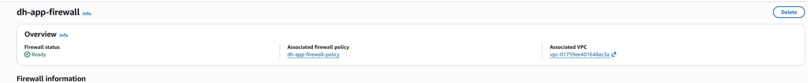

**[CHỤP MÀN HÌNH - MH2 02] Firewall endpoints**

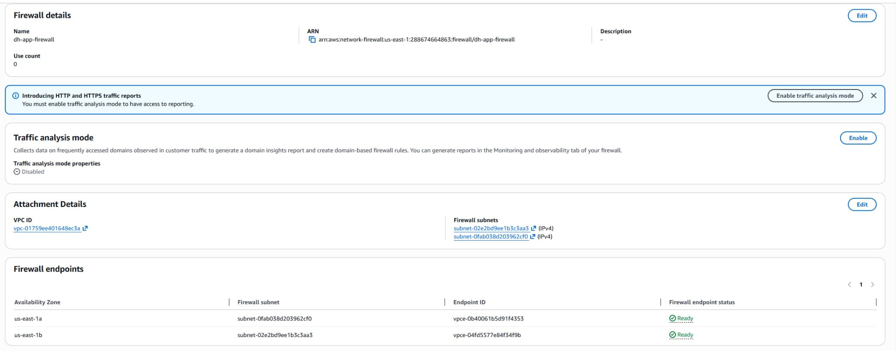

**[CHỤP MÀN HÌNH - MH2 03] Private app route tới firewall**

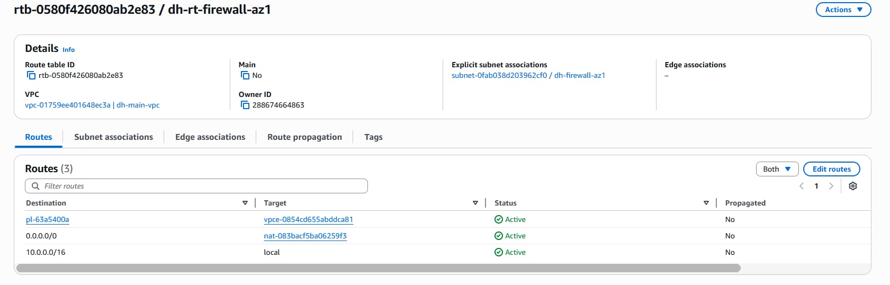

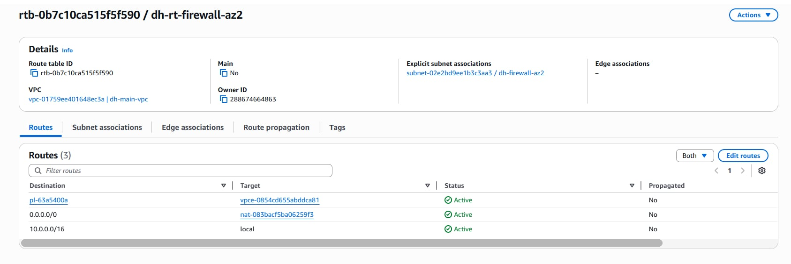

**[CHỤP MÀN HÌNH - MH2 04] Firewall route tới NAT**


**[CHỤP MÀN HÌNH - MH2 05] Firewall Alert Logs**


---

## 4. MH3 - File Storage Layer + Backup Plan

### Yêu cầu đề bài

Bắt buộc:

- Có EFS hoặc FSx mount vào app tier trong private subnet.
- File storage phục vụ nội dung thật của ứng dụng.
- Backup plan bao trùm file system, database W3 và EBS volume W2.
- Có recovery point Completed.
- Có restore job Completed.
- Có bằng chứng đọc được data từ resource đã restore.

### File storage của dự án

Team dùng **Amazon EFS** mount vào `order-service` tại `/mnt/shared`.

| Mục | Giá trị |
|---|---|
| EFS app đang mount | `fs-060f6779a2539a354` |
| Mount path | `/mnt/shared` |
| Transit encryption | enabled |
| IAM authorization | enabled |
| Mount target AZ1 | `10.0.11.79` |
| Mount target AZ2 | `10.0.12.176` |
| Security group | `EFS-SG` |
| Inbound rule | TCP 2049 từ `ECS-APP-SG` |

### Backup plan

| Mục | Giá trị |
|---|---|
| Backup plan | `dh-production-backup-plan` |
| Backup vault | `dh-backup-vault` |
| Schedule | `cron(0 19 * * ? *)` UTC |
| Retention | 7 days |
| IAM role | `dh-backup-role` |
| Backup selection W5 | `1240f4dd-c4cf-4db7-ac53-e803037e4a02` |

Resources trong backup selection W5:

| Resource | ARN/ID |
|---|---|
| EFS app | `fs-060f6779a2539a354` |
| RDS database | `dh-app-db` |
| EBS W2 | `vol-0c0e17479654f3c5a` |

### Kết quả backup và restore

| Hạng mục | Kết quả |
|---|---|
| EFS backup job | `2f85fab2-fc82-4ef7-b7a8-e31975b57354` - COMPLETED |
| EBS backup job | `614f0612-ec45-4af7-94a2-93de8e97f7ff` - COMPLETED |
| RDS backup job | `b76d046b-9299-45cf-ae1b-4c11c8a29643` - COMPLETED |
| EBS restore job | `988121dc-fa48-4809-ab8b-fe4ae25a1e8f` - COMPLETED |
| EBS restored volume | `vol-0dd4f0cb19927412b` |
| RDS restore job | `d7c6051e-4a50-4aa7-aac9-9df0addfe35b` - COMPLETED |
| RDS restored DB | `dh-app-db-w5-restore` |
| Data verification | ECS task log: `RESTORE_VERIFY products=3 users=7` |

Lưu ý chi phí: giữ `dh-app-db-w5-restore`, `vol-0c0e17479654f3c5a`, `vol-0dd4f0cb19927412b` đến khi chụp evidence xong, sau đó xoá để tránh phát sinh chi phí.

### Ảnh cần chụp

**[CHỤP MÀN HÌNH - MH3 01] EFS available**

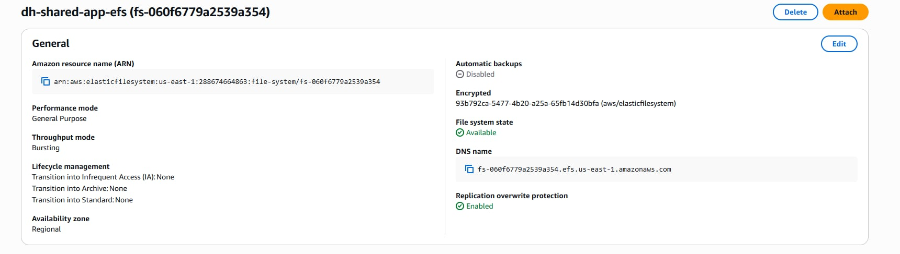

**[CHỤP MÀN HÌNH - MH3 02] EFS mount targets**

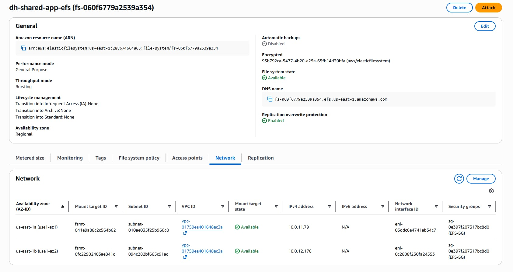

**[CHỤP MÀN HÌNH - MH3 03] ECS task mount EFS**

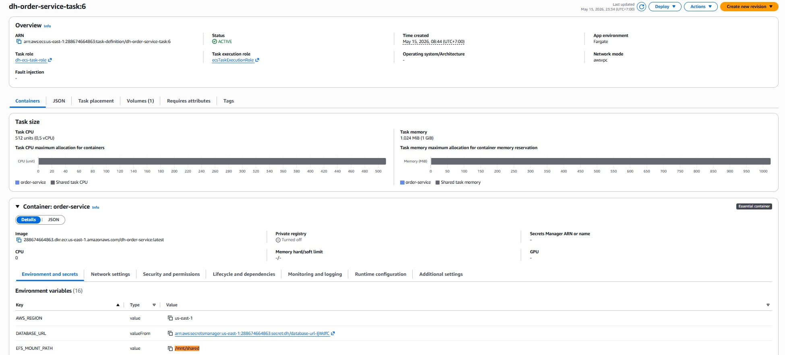

**[CHỤP MÀN HÌNH - MH3 04] Backup selection W5**

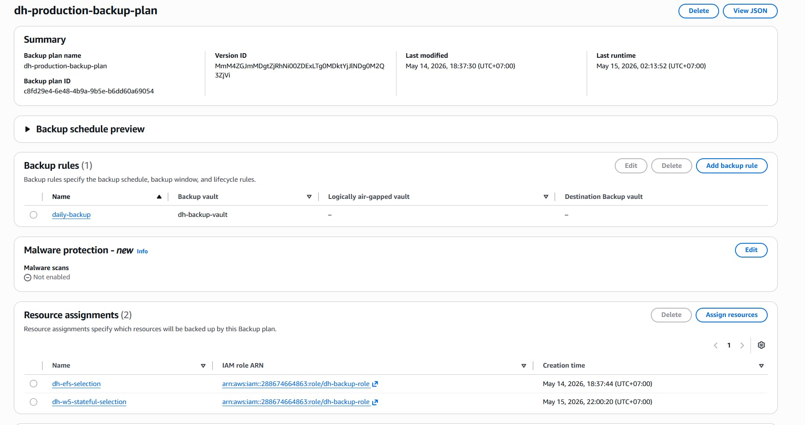

**[CHỤP MÀN HÌNH - MH3 05] Recovery points Completed**

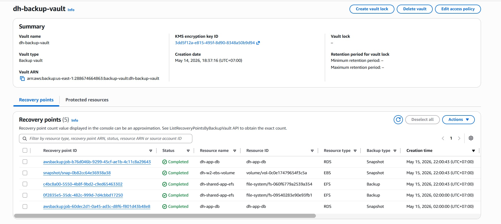

**[CHỤP MÀN HÌNH - MH3 06] Restore jobs Completed**

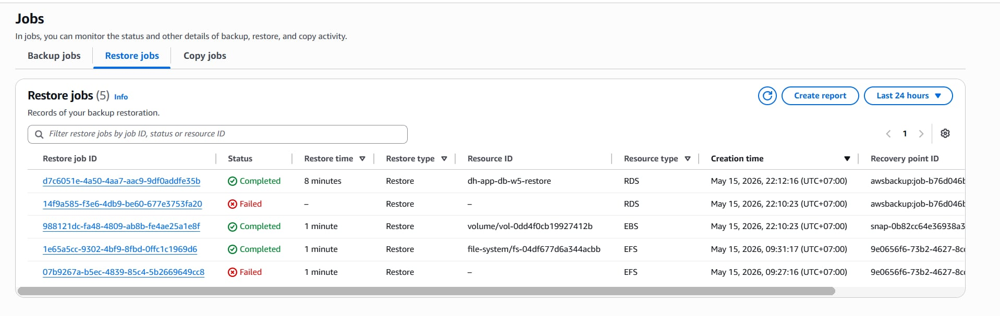

**[CHỤP MÀN HÌNH - MH3 07] Data verification từ RDS restore**

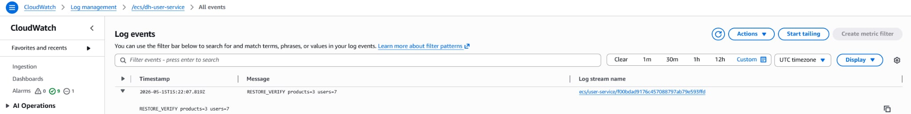

---

## 5. MH4 - API Gateway + Auth + Throttling

### Yêu cầu đề bài

Bắt buộc:

- API Gateway đứng trước Lambda.
- Lambda proxy integration.
- Có auth/API key.
- Có usage plan với rate + burst throttling.
- Request có auth trả `200`.
- Request không auth trả `403`.

### Cấu hình AWS

| Mục | Giá trị |
|---|---|
| API name | `dh-app-api` |
| API ID | `qcrj9djdh4` |
| Type | REST API |
| Stage | `prod` |
| Resource | `/orders/process` |
| Method | POST |
| API key required | true |
| Integration | Lambda proxy |
| Lambda | `dh-order-processor` |
| Usage plan | `dh-standard-plan` |
| Throttle | 10 rps, burst 20 |
| Quota | 1000 requests/day |

### Test commands

```powershell
# Có API key - kỳ vọng 200
curl -X POST "https://qcrj9djdh4.execute-api.us-east-1.amazonaws.com/prod/orders/process" `
  -H "Content-Type: application/json" `
  -H "x-api-key: <API_KEY>" `
  -d "{\"eventType\":\"ORDER_PAID\",\"orderId\":\"demo-001\"}"

# Không có API key - kỳ vọng 403
curl -X POST "https://qcrj9djdh4.execute-api.us-east-1.amazonaws.com/prod/orders/process" `
  -H "Content-Type: application/json" `
  -d "{\"eventType\":\"ORDER_PAID\",\"orderId\":\"demo-001\"}"
```

### Ảnh cần chụp

**[CHỤP MÀN HÌNH - MH4 01] API Gateway resource**

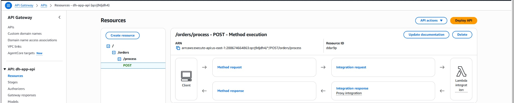

**[CHỤP MÀN HÌNH - MH4 02] API key required**

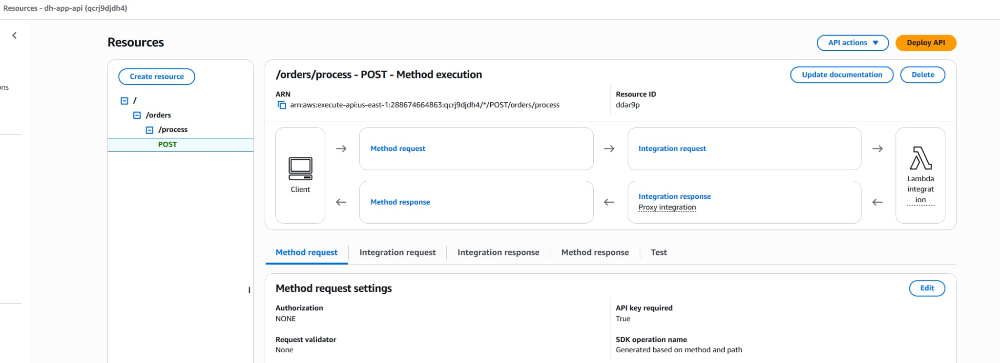

**[CHỤP MÀN HÌNH - MH4 03] Lambda proxy integration**

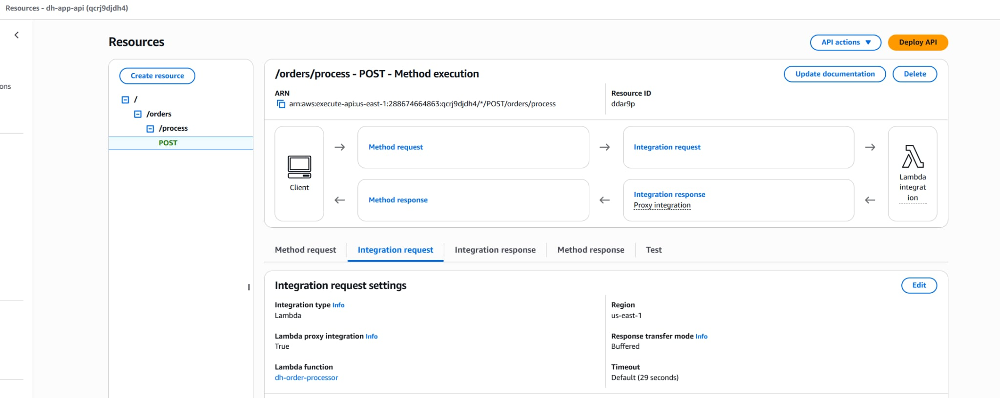

**[CHỤP MÀN HÌNH - MH4 04] Usage plan throttling**

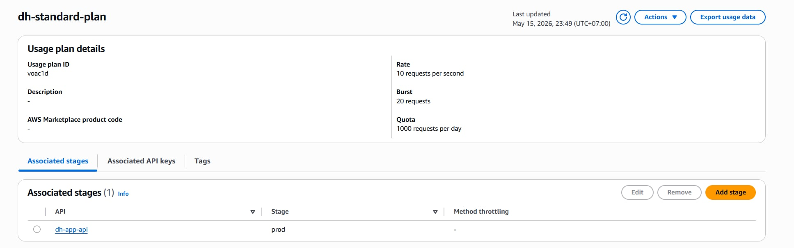

**[CHỤP MÀN HÌNH - MH4 05] Curl có API key trả 200**

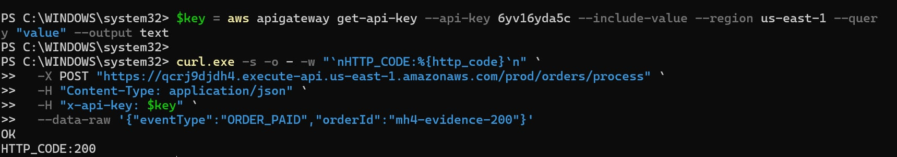

**[CHỤP MÀN HÌNH - MH4 06] Curl không API key trả 403**

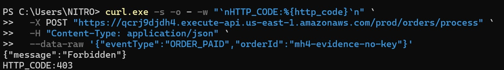

---

## 6. MH5 - Serverless Scaling Pattern

### Yêu cầu đề bài

Chọn một scaling pattern thật áp dụng lên Lambda đang có. Các pattern hợp lệ:

- Reserved Concurrency.
- Provisioned Concurrency.
- Async Invocation + DLQ.
- S3-event-triggered Lambda Pattern.

Đề bài **không bắt buộc phải dùng SQS**. SQS + DLQ chỉ là một pattern hợp lệ nếu team chọn hướng async processing.

### Lựa chọn của dự án

Team chọn **Async Invocation + Dead Letter Queue** cho Lambda `dh-order-processor`.

Lý do: dự án đã có order flow bất đồng bộ qua SQS. `order-service` gửi event vào `dh-order-queue`, Lambda xử lý event, nếu lỗi thì message đi vào DLQ để debug.

### Cấu hình AWS

| Thành phần | Giá trị |
|---|---|
| Lambda | `dh-order-processor` |
| Runtime | Python 3.12 |
| Queue chính | `dh-order-queue` |
| DLQ | `dh-lambda-dlq` |
| Trigger | SQS -> Lambda |
| Batch size | 1 |
| SQS redrive | maxReceiveCount = 3 |
| Lambda async retry | MaximumRetryAttempts = 2 |
| Lambda OnFailure | SQS `dh-lambda-dlq` |

### Ảnh cần chụp

**[CHỤP MÀN HÌNH - MH5 01] Lambda SQS trigger**

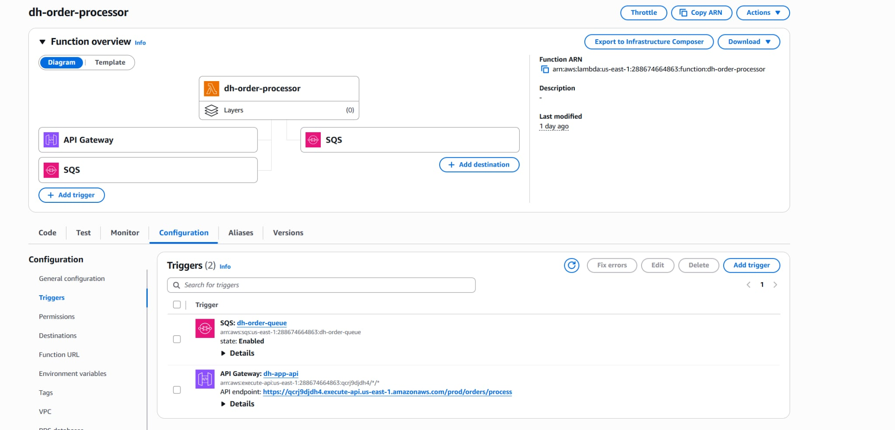

**[CHỤP MÀN HÌNH - MH5 02] Lambda async failure destination**

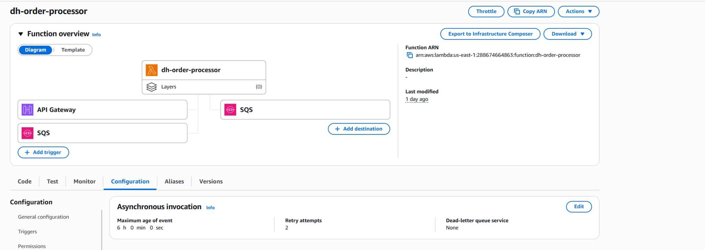

**[CHỤP MÀN HÌNH - MH5 03] SQS redrive policy**

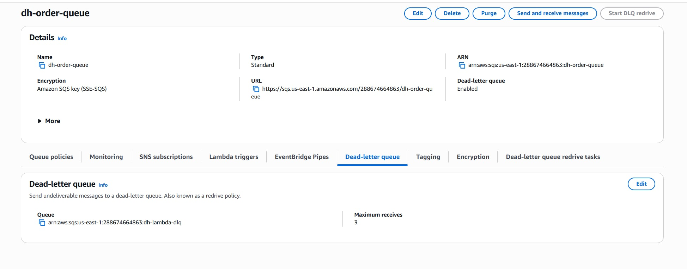

**[CHỤP MÀN HÌNH - MH5 04] DLQ evidence**

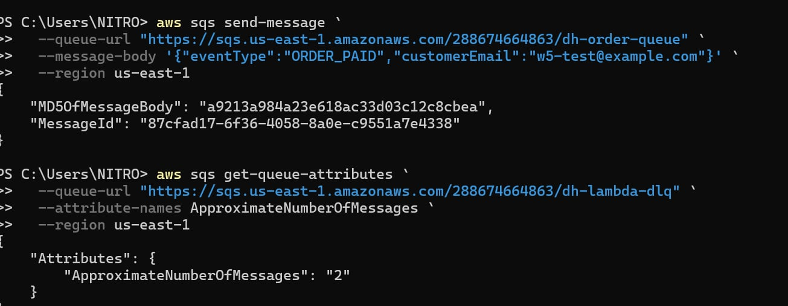

---

## 7. Application Carry-Forward Verification

### Yêu cầu đề bài

Ứng dụng từ các tuần trước phải vẫn deploy và chạy end-to-end. Architecture diagram phải khớp với những gì thật sự deploy. Trong presentation cần show 1-2 action live chứng minh app chạy đúng.

### Kiến trúc đang deploy

```text
Users
  -> Route 53 / CloudFront
  -> WAF
  -> S3 Frontend
  -> ALB
  -> ECS Fargate services
  -> RDS PostgreSQL / Redis / EFS / SQS / Lambda
```

### Trạng thái app

| Thành phần | Trạng thái |
|---|---|
| CloudFront | HTTP 200 |
| `dh-user-service` | running 1/1 |
| `dh-menu-service` | running 1/1 |
| `dh-order-service` | running 1/1 |
| `dh-user-tg` | healthy |
| `dh-menu-tg` | healthy |
| `dh-order-tg` | healthy |
| RDS `dh-app-db` | available, private, Multi-AZ, encrypted |

### Ảnh cần chụp

**[CHỤP MÀN HÌNH - App 01] Frontend qua CloudFront**


**[CHỤP MÀN HÌNH - App 02] Action end-to-end**


**[CHỤP MÀN HÌNH - App 03] ECS services running**


**[CHỤP MÀN HÌNH - App 04] Target groups healthy**

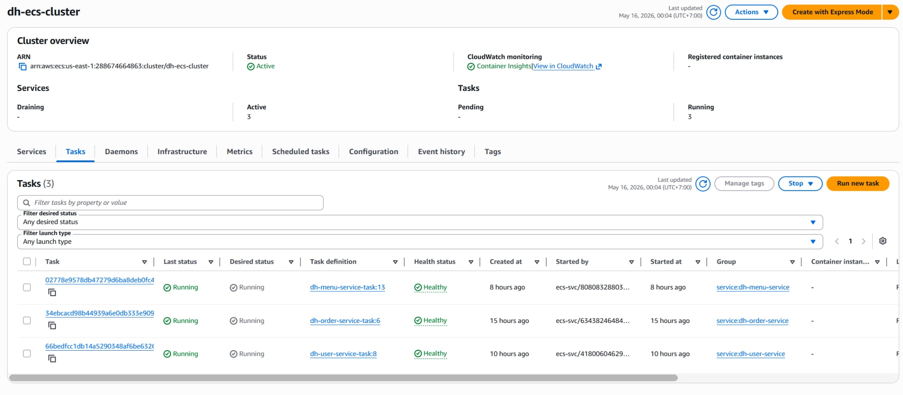

**[CHỤP MÀN HÌNH - App 05] RDS private available**

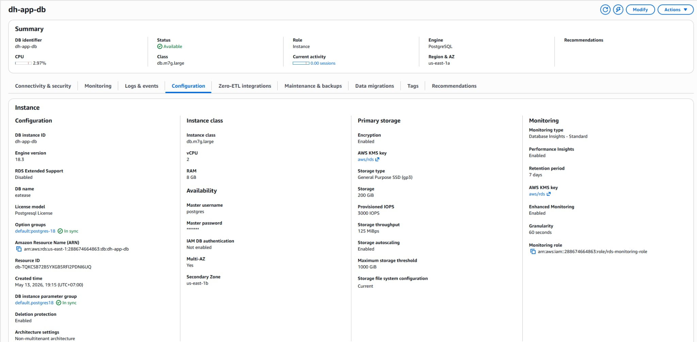

---

## 8. Negative Security Tests

### Yêu cầu đề bài

Evidence Pack phải có negative test, không chỉ có happy path. Ít nhất cần chứng minh request không hợp lệ bị từ chối hoặc bị chặn.

### Negative tests của dự án

| Test | Cách test | Kết quả kỳ vọng | Trạng thái |
|---|---|---|---|
| API Gateway không API key | Curl POST `/orders/process` không có `x-api-key` | HTTP 403 | Đạt |
| ALB invalid path | Curl `/invalid-path` trên ALB | HTTP 404 | Đạt |
| RDS direct public access | Connect từ local tới RDS port 5432 | Timeout/refused | Đạt |
| S3 direct public access | Mở S3 object URL trực tiếp | HTTP 403 AccessDenied | Đạt |
| Network Firewall blocked alert | Request tới domain bị chặn và xem Alert Logs | Cần alert log | TODO nếu trainer yêu cầu ảnh firewall blocked |

### Ảnh cần chụp

**[CHỤP MÀN HÌNH - Negative 01] API Gateway không API key trả 403**

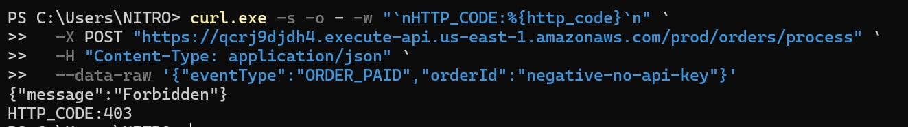

**[CHỤP MÀN HÌNH - Negative 02] ALB invalid path trả 404**

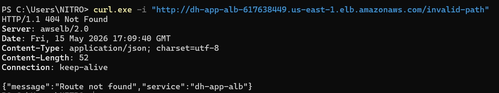

**[CHỤP MÀN HÌNH - Negative 03] RDS direct access bị timeout**

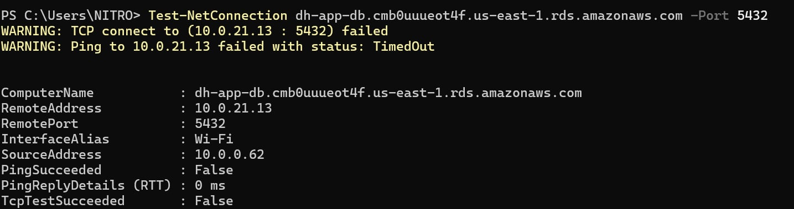

**[CHỤP MÀN HÌNH - Negative 04] S3 direct object trả 403**

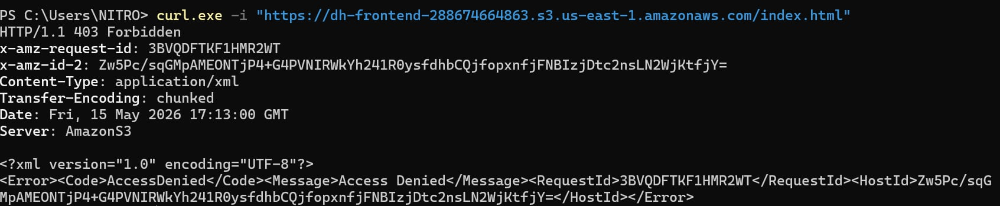

**[CHỤP MÀN HÌNH - Negative 05] Network Firewall blocked alert**


---

## 9. Bonus - Optional

| Bonus | Trạng thái | Evidence |
|---|---|---|
| VPC Reachability Analyzer | Not attempted | N/A |
| Backup Vault Lock | Not attempted | N/A |
| Lambda Power Tuning | Not attempted | N/A |
| API Gateway custom domain | Not attempted | N/A |
| CloudFormation template cho W5 resource | Not attempted | N/A |

---

## 10. Final Architecture Diagram cần nộp

Diagram cuối nên thể hiện các thành phần sau:

```text
Users
  -> Route 53
  -> CloudFront + WAF
  -> S3 Frontend / S3 Media Storage
  -> ALB
  -> ECS Fargate: user-service, menu-service, order-service
  -> RDS Primary/Standby + ElastiCache Primary/Standby
  -> EFS mounted to order-service at /mnt/shared              [MH3]
  -> SQS dh-order-queue -> Lambda dh-order-processor -> DLQ   [MH5]

Private app outbound:
ECS -> Network Firewall -> NAT Gateway -> Internet            [MH2]

API surface:
API Gateway -> Lambda dh-order-processor                      [MH4]

Observability and recovery:
VPC Flow Logs -> CloudWatch Logs                              [MH1]
Network Firewall Alert Logs -> CloudWatch Logs                [MH2]
AWS Backup -> EFS/RDS/EBS recovery points + restore test      [MH3]
CloudTrail + Secrets Manager                                  [Security/Ops]
```

### Ảnh cần chụp

**[CHỤP MÀN HÌNH - Diagram 01] Final architecture diagram**


---

## 11. Submission Checklist

| Mục | Trạng thái |
|---|---|
| Cover có group, thành viên, repo, region | TODO |
| MH1 có topology rationale và Flow Logs sample | TODO |
| MH2 có firewall, route table, alert logging | TODO |
| MH2 có blocked alert log | TODO |
| MH3 có EFS mount | TODO |
| MH3 có backup EFS/RDS/EBS Completed | TODO |
| MH3 có restore job Completed và data verification | TODO |
| MH4 có API Gateway, API key, throttle, 200/403 | TODO |
| MH5 có scaling pattern trên Lambda thật | TODO |
| Application Carry-Forward có app live end-to-end | TODO |
| Negative Security Tests có ảnh 403/404/timeout/403 | TODO |
| Slide Friday có link về commit Evidence Pack | TODO |
